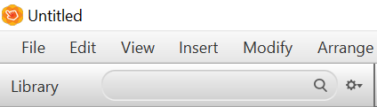

# Instruction de compilation

## Prérequis

- [IntelliJ IDEA](https://www.jetbrains.com/idea/) (Peut importe Community ou Ultimate)
- [JDK 8u281](https://www.oracle.com/java/technologies/javase/javase-jdk8-downloads.html)
- [Gluon's Scene Builder](https://gluonhq.com/products/scene-builder/#download)

## Guide

### Configurer SceneBuilder

- Lancer SceneBuilder
- Fermer la pop-up d'accueil
- Cliquer sur la roue crantée à droite du champs de recherche Library, en haut à gauche \
  
- Cliquer sur l'option "JAR/FXML Manager"
- Cliquer sur le lien "Manually add Library from repository"
- Installer les librairies suivantes : \
  **JFOENIX** \
  Group ID : com.jfoenix \
  Artifact ID : jfoenix \
  Version : 9.0.10 \
  \
  **FONTAWESOME** \
  Group ID : de.jensd \
  Artifact ID : fontawesomefx-fontawesome \
  Version : 4.7.0-9.1.2
- Quitter SceneBuilder

### Configurer IntelliJ

- Sur l'écran de sélection des projets, cliquer sur "Open from VCS"
- Cloner le dépôt du projet
- Une fois le projet ouvert, aller dans File > Settings > Plugins et installer Lombok
- Ouvrir le un fichier FXML dans le dossier src/main/java/resources/fxml en faisant un clic droit dessus, puis "Open in
  SceneBuilder"
- Sélectionner le binaire de SceneBuilder à l'emplacement où il est installé
- Une fois SceneBuilder ouvert sans problèmes, le fermer

- Vous pouvez maintenant construire le projet